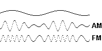

# LA MODULAZIONE

 la modulazione si può dividire in due tipi 

- modulazione per ampiezza AM (amplitude modulation)
- modulazione per frequenza FM (frequency modulation)

> # Amplitude Modulation:
> la modulazione per ampiezza o altezza e un modo relativamente semplice per trasferire informazioni (la maggior parte delle volte segnali audio attraverso le onde radio) per lunghe distanze e funziona addizionando le informazioni a una carrier wave (un onda portante)
>>una carrier wave e un onda quasi sempre in forma sinusoidale che può essere poi sommata a un segnale detto modulato
>>----
>i segnali combinati sarrano poi trasmessi sul canale, in radio i segnali AM sono capaci di essere ricevuti da un cristallo che non richiede energia per funzionare.
----
># Frequency Modulation:
>Nell FM invece si trasmettono informazioni variando la frequenza come nel' am si trasferisce l'informazione aggiungendola ad una carrier wave e modulando la ampiezza mantenendo una frequenza costante nell fm si aggiunge un segnale ad una carrier wave e si modula la frequenza (in orizzontale invece che verticale) e mantiene la ampiezza uguale i segnali radio FM hanno una qualita di segnale migliore rispetto a i segnali AM ma non viaggiano lontano quanto quelli am dato che i segnali di frequenza più alta non rimbalzano sulla ionosfera della terra in particolare la parte nota come il Kennely-Heaviside layer anche se i segnali am sono rimasti in utilizzo per un periodo di tempo per talk show e interviste dato che la qualità era sufficiente per il suono delle voci ma l'FM e più usato per la musica per la sua qualità di suono più alto e la sua capacità di includere un "segnale di differenza" che può essere usato per estrarre audio stereo.

(aleatorio significa non deterministico)