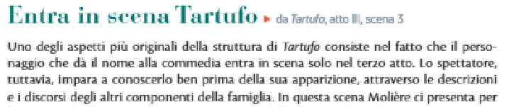
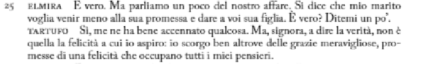
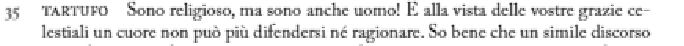
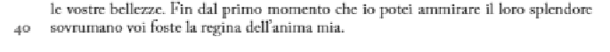

# 1) Trova le battute a doppio senso

- In vista delle vostre grazie.
- Tocco la vostra veste
- Io scorgo ben oltre le grazie meravigliose
- Mostrare la mia anima
- Uno zelo straordinario
# 2) A cosa rimanda "non sono mica un angelo"
Al fatto che gli angeli sono privi di peccato e brave persone devote esclusivamente ala vita spirituale senza desideri terreni
# 3) 26-30
zalmira fa finta di non aver capito che la felicita a cui aspira tartufo sia lei e che sia invece la salvezza spirituale per provare ad incastrarlo 
# 4) Antitesi
- Mai Ho Creduto di farle male, e preferirei mille volte piuttosto 
- Sono religioso ma anche uomo
# 5) Pensieri e parole
- Tocco la vostra veste ("che belle gambe")
- io scorgo ben oltre le grazie meravigliose ("perche in realta cerco te")
- Mostrare la mia anima ("mettermi con te")
- in vista delle vostre grazie ("le vostre due grandi grazie")

# Vizi Previlegiati

Secondo me molier intende che non vede perche alcuni vizi/alcune azioni compiute da persone malvaggie non possano essere criticati o fatti satira solo perche coinvolgono la religione 

# Entra In scena tartufo

